# GTG — Go To Gym

A professional, installable workout tracker where every exercise is
rendered as an animated 3D form guide. A procedurally-rigged figure
performs each movement on real equipment — bench, barbell, dumbbells,
squat stance, cable stations, dip bars, pull-up bar — with hands pinned
to the bars by an analytic IK solver so the motion matches published
form references.

The whole app is a static PWA: install it to your phone and all your
sets, reps, and weights live in `localStorage`. Works offline at the
gym. Data export/import built in.


---

## What's in it

- **Today** — a daily suggestion from a 7-day Push/Pull/Legs ×2 + Core
  split, with a day picker to swap workouts. Hero stage animates the
  current exercise; the logger below auto-saves sets, detects PRs, and
  starts a rest timer every time you check off a set.
- **Exercises** — a 28-exercise library grouped by muscle (Chest, Back,
  Shoulders, Triceps, Biceps, Legs, Core), each tile a live 3D
  animation with equipment tags.
- **Progress** — training dashboard: workouts logged, week streak,
  weekly volume chart, per-exercise strength trends (estimated 1RM),
  push/pull/legs/core balance, and JSON export/import.
- **History** — every session as a date-stamped card with day title,
  set-by-set breakdowns, and volume totals.
- **Goal** — bench-press progression toward an editable target
  (default 135 lb), with an Epley 1RM trend chart.

## The 3D rigs

Each exercise defines `rig(t)` returning a pose (anatomical joint
angles) plus equipment hints. Two systems keep the animation honest:

1. **Two-bone arm IK** — exercises specify world-space hand targets
   (`ikL`/`ikR` with an elbow pole hint), so hands grip the pull-up
   bar, barbell, cable handles, and floor *exactly*, at every frame.
   Bar path keyframes (bench J-curve, deadlift drag up the shins,
   pulldown to the collarbone) come from published form guides
   (StrongLifts, ExRx, NASM, ACE, StrengthLog).
2. **Planted-leg solver** — squat/hinge rigs compute root offsets from
   hip/knee flexion so the feet never leave the floor while hips
   travel down-and-back.

The figure has a full skeleton — shoulder girdle, pelvis, articulated
ankles and feet — and props (plates, collars, adjustable pulleys,
thigh pads, footplates) snap to it every frame.

### Push

| Bench Press | Incline DB Press | DB Chest Fly |
|---|---|---|
|  |  | 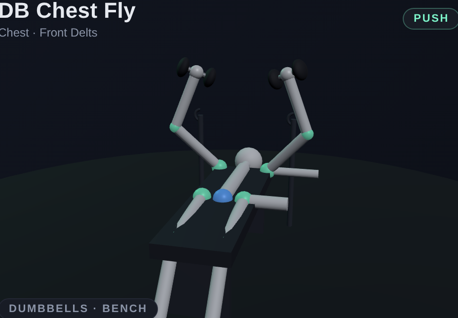 |

| Overhead Press | Push-up | Triceps Dip |
|---|---|---|
|  |  |  |

| Tricep Pushdown | Overhead Triceps Ext. | DB Lateral Raise |
|---|---|---|
|  | 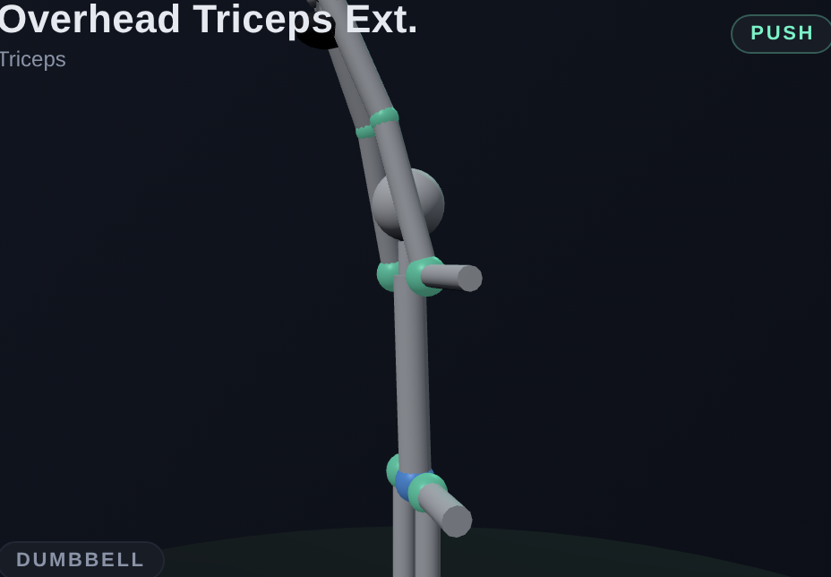 | 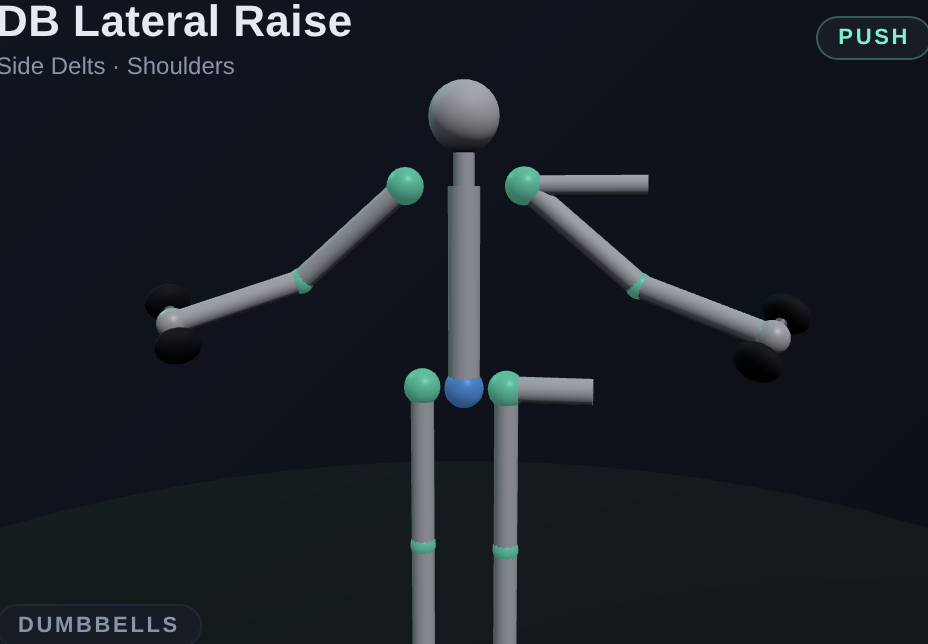 |

### Pull

| Pull-up | Bent-over Row | Lat Pulldown |
|---|---|---|
|  |  |  |

| Seated Cable Row | Face Pull | Bicep Curl |
|---|---|---|
| 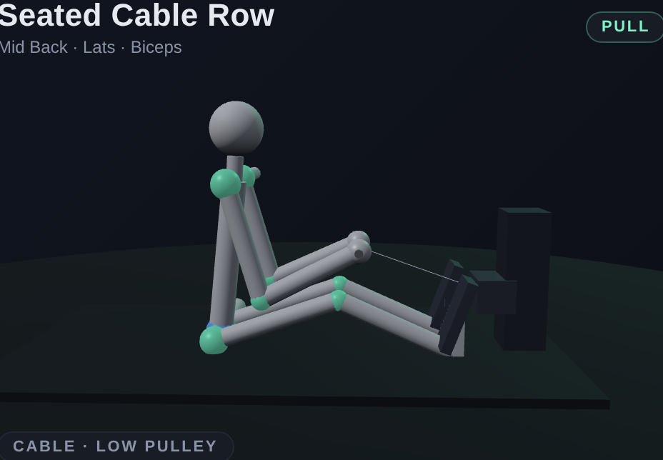 | 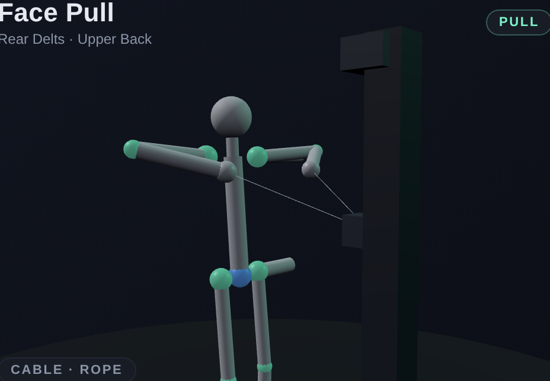 |  |

| Alt. Hammer Curl | | |
|---|---|---|
| 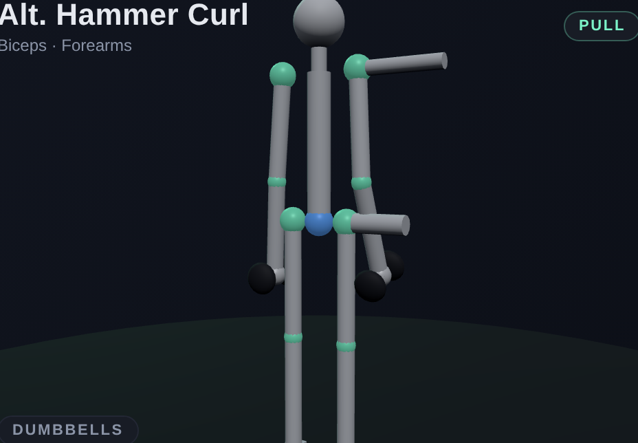 | | |

### Legs

| Back Squat | Deadlift | Romanian Deadlift |
|---|---|---|
| 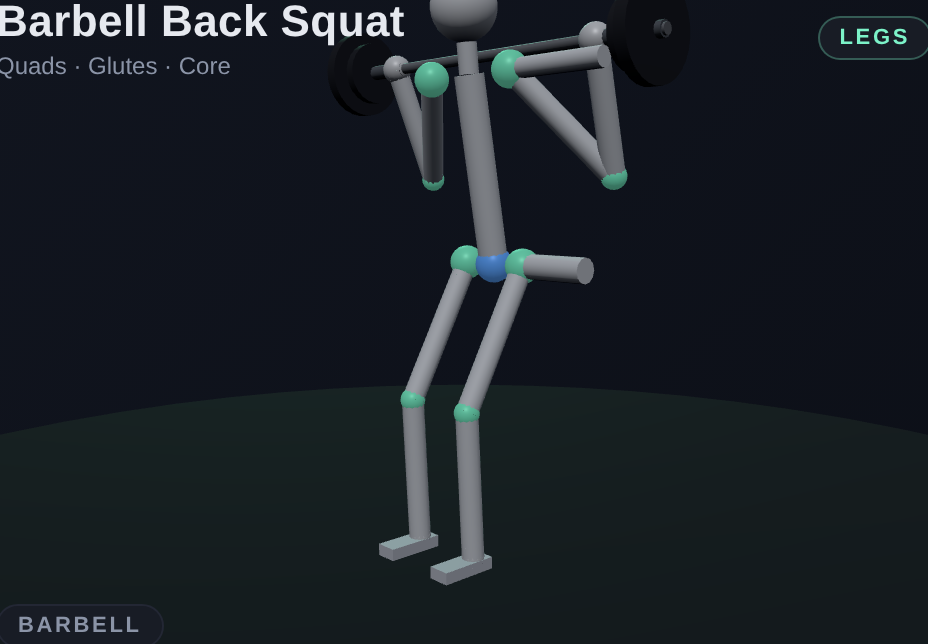 | 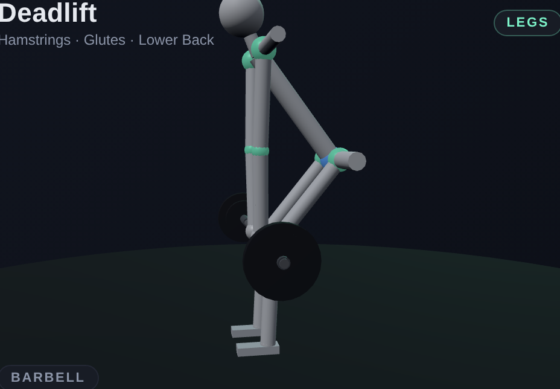 | 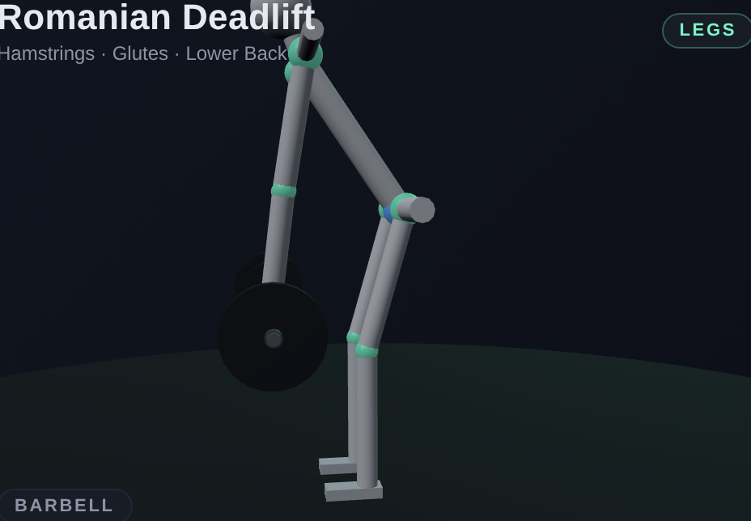 |

| DB Split Squat | Glute Bridge | Standing Calf Raise |
|---|---|---|
| 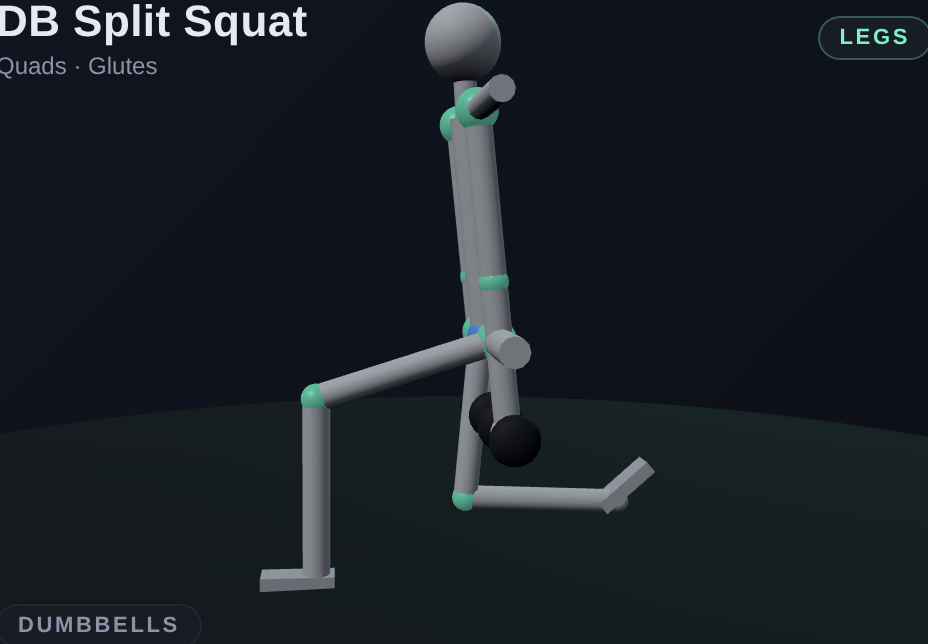 | 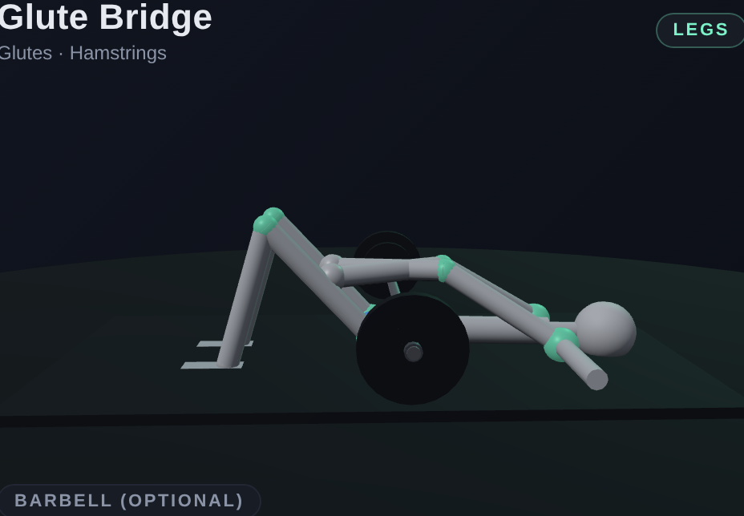 | 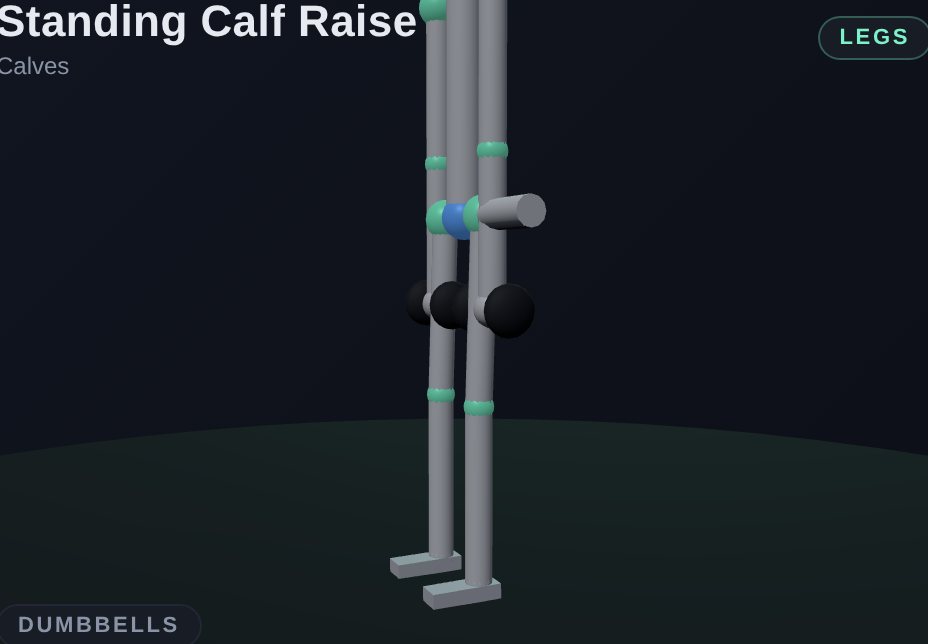 |

### Core

| Plank | Crunch | Russian Twist |
|---|---|---|
|  |  |  |

| Hanging Leg Raise | Mountain Climbers | Dead Bug |
|---|---|---|
|  | 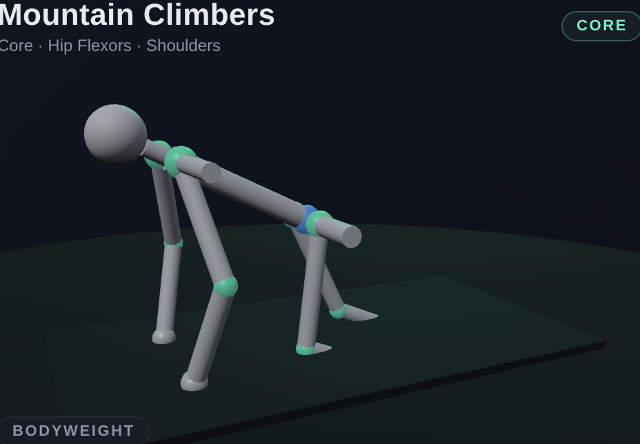 | 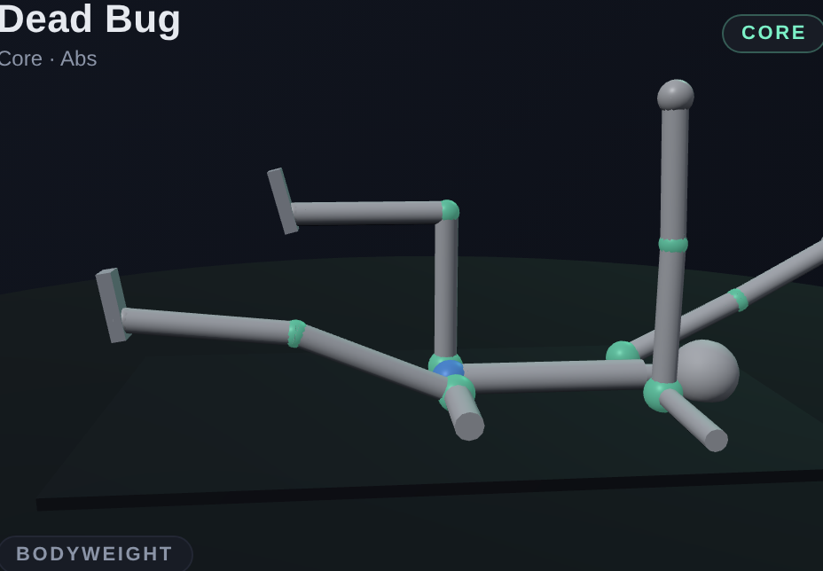 |

## Training week

Push/Pull/Legs run twice, bench prioritized for the Goal tab, plus a
core/recovery day:

| Day | Workout |
|---|---|
| Mon | **Push A — Bench Strength**: bench 4×5, incline DB, dips, overhead extension, plank |
| Tue | **Pull A — Back Width**: pull-ups, rows, seated cable row, curls, hanging leg raise |
| Wed | **Legs A — Squat Focus**: squat 4×6, RDL, split squat, calf raise, crunch |
| Thu | **Push B — Bench Volume**: bench 3×8-10, push-ups, flys, OHP, lateral raise |
| Fri | **Pull B — Deadlift & Rear**: deadlift 3×5, pulldown, face pull, hammer curl, twists |
| Sat | **Legs B — Posterior Chain**: glute bridge, squat volume, calves, conditioning |
| Sun | **Core & Reset**: plank, dead bug, mountain climbers, twists, crunch |

Any day can be swapped from the picker — the suggestion just follows
the calendar.

## Tracking

- **Set logging** with per-exercise defaults; tap the set number to
  mark it done.
- **Rest timer** auto-starts on each completed set (adjustable ±15 s,
  remembers your preference, vibrates when it's time).
- **PR detection** — every completed set is compared against your
  historical best estimated 1RM; new records get a toast.
- **Progress analytics** — weekly volume, week streak, per-exercise
  1RM trend, and a push/pull/legs/core volume balance for the last 30
  days.
- **Export / import** — one-tap JSON backup of everything.

## Tech

- **Vite + vanilla JS** (no framework — direct DOM, hash router)
- **three.js** for the 3D figures, equipment, and the IK solver
- **vite-plugin-pwa** for the service worker and installability
- **localStorage** for all session data

## Running it

```bash
npm install
npm run dev          # local dev server
npm run build        # production bundle in dist/
npm run preview      # preview the built bundle
npm run screenshots  # regenerate the PNGs in docs/screenshots/
```

The screenshot script (`scripts/screenshots.mjs`) builds the app,
launches `vite preview`, then drives it with Playwright (uses the
globally-installed copy if available) to capture each exercise's hero
canvas.

## Deploying to Vercel

Already configured. Import the repo on Vercel, accept the auto-detected
Vite framework, and deploy. The bundled `vercel.json` sets cache
headers for the service worker, hashed assets, and an SPA rewrite.

## Project layout

```
src/
├── main.js              # router + views: today/exercises/progress/history/goal
├── pwa.js               # service worker registration + install prompt
├── store.js             # localStorage history, settings, analytics, export
├── style.css
├── data/
│   └── exercises.js     # 28 exercises: cues, defaults, rig(t), IK targets, cameras
└── three/
    ├── stickFigure.js   # skeleton, pose/IK solvers, environments (benches/stations)
    ├── props.js         # barbell/dumbbells/cables/handles that track the hands
    └── stage.js         # per-canvas three.js scene + render loop

scripts/
└── screenshots.mjs      # Playwright capture for the README
```

To add an exercise: append an entry to `EXERCISES` in
`src/data/exercises.js` with primary muscles, cues, defaults, a
`rig(t)` (FK pose and/or IK hand targets), and a camera. The library,
split picker, logger, and analytics pick it up automatically.
