# GTG — Go To Gym

A sleek, installable workout tracker built around getting stronger on
the upper body, core and kettlebell work. Every exercise is rendered in
3D with a procedurally-rigged stick figure on real equipment — bench,
dumbbells, barbell, kettlebells, cable column, dip station — so you can
see the motion before you do it.

Every exercise is also classified in depth — movement pattern, plane,
force, muscles by role, joint actions, equipment, level, and 1–5 demand
scores for grip, core, cardio, balance, technique, spinal load and
systemic cost — so routines can be generated and imported rather than
hand-written.

The whole app is a static PWA: log in once, install to your phone, and
all your sets, reps, and weights are kept in `localStorage`. Works
offline at the gym.


---

## What's in it

- **Today** — a daily plan from the program you pick (four are built in,
  from the 5-day bench split to a 3-day kettlebell conditioning block).
  Hero stage shows the current exercise's animated 3D rig; below, a
  logger with sets, reps, and weight that auto-saves, and a full
  classification read-out: muscles by role, joint actions, demand
  scores, common mistakes, and links to easier/harder variations.
- **Exercises** — 31 exercises, groupable by muscle, equipment,
  movement pattern, goal, or level; each tile a live mini three.js
  animation.
- **History** — every past session as a date-stamped card with total
  sets, total volume, and per-exercise breakdowns.
- **Goal** — bench-press progression toward 135 lb. Pulls your top
  set per session, runs Epley's 1RM formula, and plots the trend
  against the goal line.

## How exercises are classified

Every exercise is described against a set of controlled vocabularies in
`src/data/taxonomy.js`, and the whole app — library grouping, filters, the
detail card, routine analysis — is a read over that classification. Five
things are kept deliberately separate:

| Question | Fields |
|---|---|
| What shape is the movement? | `pattern`, `planes`, `force`, `mechanics`, `chain`, `laterality`, `setup` |
| What does it train? | `muscles.primary` / `.secondary` / `.stabilizers`, `jointActions` |
| How is it loaded? | `equipment`, `loading`, `metric` |
| What does it cost? | `demands` — grip, core, cardio, balance, technique, spinal load, systemic cost (1–5) |
| How do you program it? | `level`, `goals`, `programming`, `progression` |

The kettlebell swing is the reason those axes are separate. Calling it "cardio"
throws away everything useful; here it's `pattern: hinge` (same joint action as
a deadlift) + `loading: ballistic` (expressed explosively) + `goals: [power,
conditioning, endurance]` + `demands.cardio: 5`. A strength day can pull it in
as a hinge, a conditioning day for the cardio score, and a builder capping
fatigue can see it costs 4 out of 5.

Because the classification is machine-readable, a routine is a query rather
than a hand-written list:

```js
buildRoutine({ equipment: ['kettlebell', 'mat'], level: 'beginner',
               goal: 'strength', minutes: 40 })
```

It walks the pattern template for the goal, picks the best-scoring exercise per
pattern that fits the kit and level, tracks a time budget and a running demand
total, and warns about anything it could not cover. `analyseRoutine(ids)` does
the same read-out for a hand-written day — patterns hit, push/pull balance,
muscle groups, demand totals, estimated minutes, missing counterparts.

`npm run validate` checks all 31 exercises against the vocabularies, verifies
every cross-reference (progressions, variations, program days) resolves, makes
sure every rig returns a finite pose across the whole loop, and prints a
coverage report.

**Full details: [docs/EXERCISE-SCHEMA.md](docs/EXERCISE-SCHEMA.md)** — every
field, every legal value, and how to add or import an exercise.

## The 3D rigs

Each exercise defines an animation function `rig(t)` that returns a pose (joint
angles in radians) plus equipment hints. A small props system reads the world
position of each hand every frame and snaps the barbell, dumbbells, kettlebells,
cable lines, or weight plate to wherever the hands actually are, so the
equipment never drifts off the figure.

The poses aren't eyeballed — `src/data/rig-kit.js` derives them from the
skeleton's segment lengths:

- `plantedLegs(thighFwd, shinFwd)` returns hip/knee angles **and** the root
  offsets that keep the feet on the floor while the hips travel back and down,
  so squats and hinges are geometrically honest.
- `armPitch(worldAngle, spine)` cancels the torso lean, so a hinged-over
  figure's arms hang under gravity instead of swinging back with the chest.
- `keyframeRig([...])` builds multi-position lifts (clean, snatch, thruster,
  get-up) from keyframes — numbers interpolate, equipment hints step.

### Kettlebell

The kettlebell library covers what the barbell can't: ballistic hip power,
offset loading, and long grip work.

| KB Swing | KB Deadlift | Goblet Squat |
|---|---|---|
| 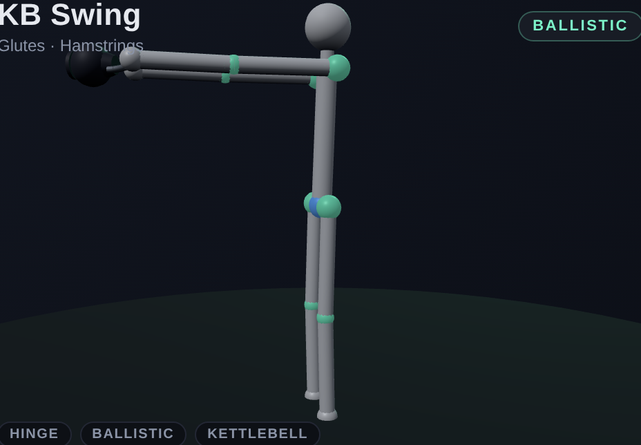 | 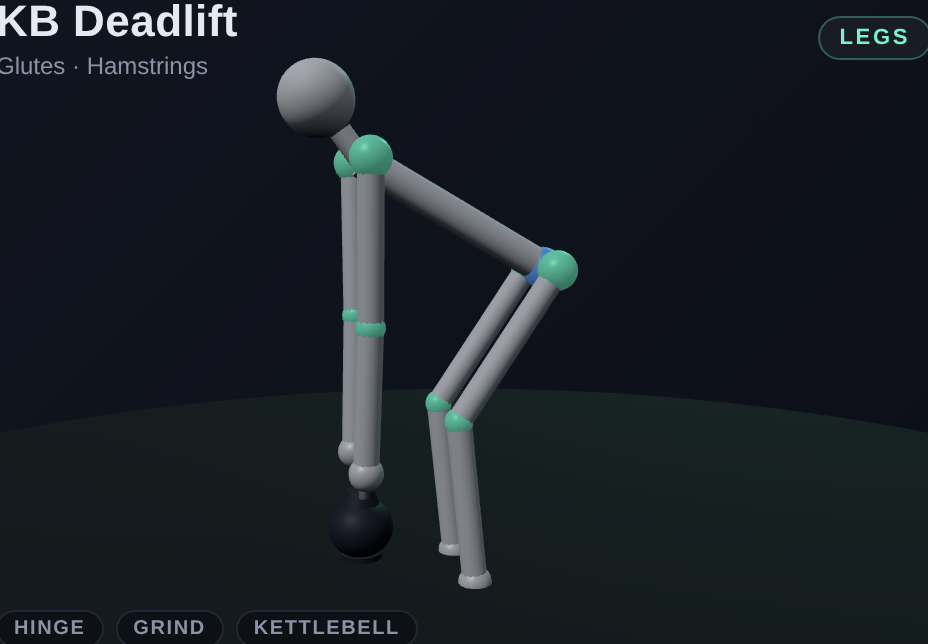 | 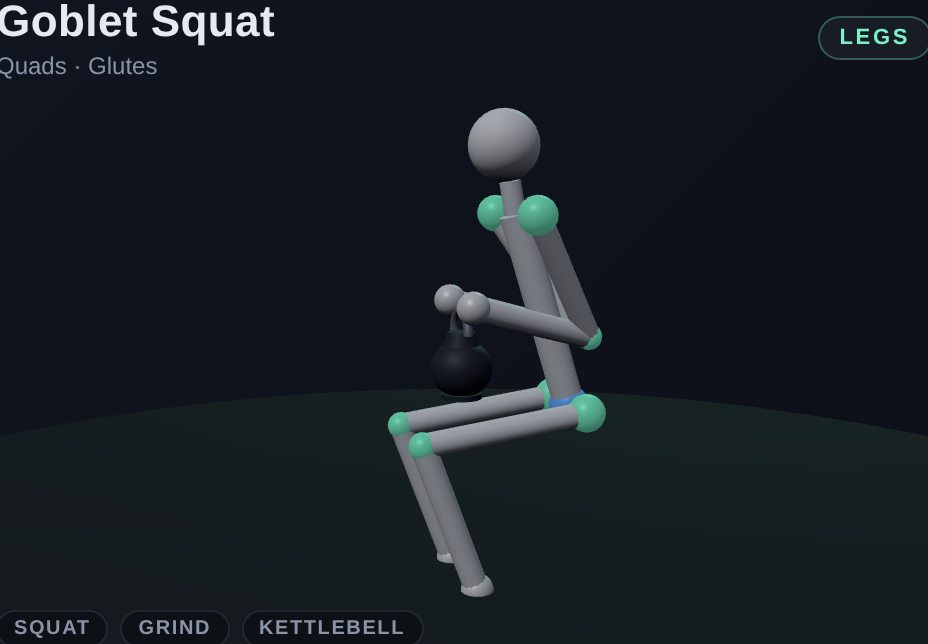 |

| KB Clean | KB Press | KB Snatch |
|---|---|---|
| 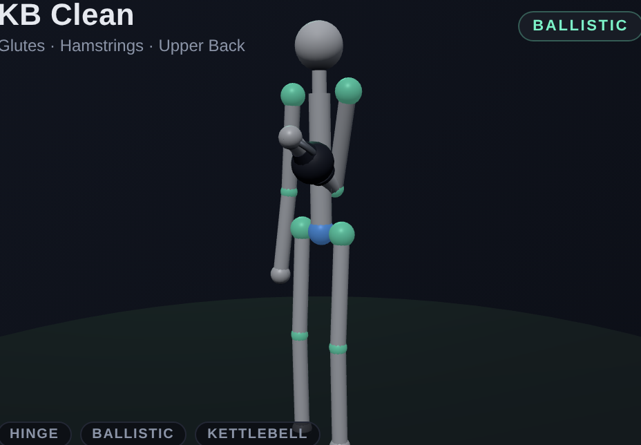 | 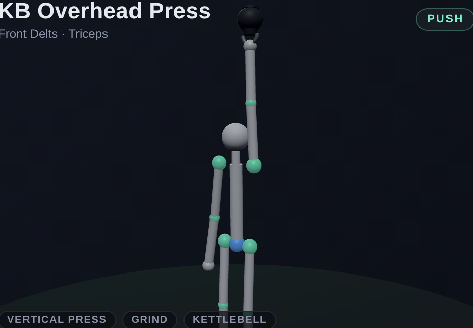 | 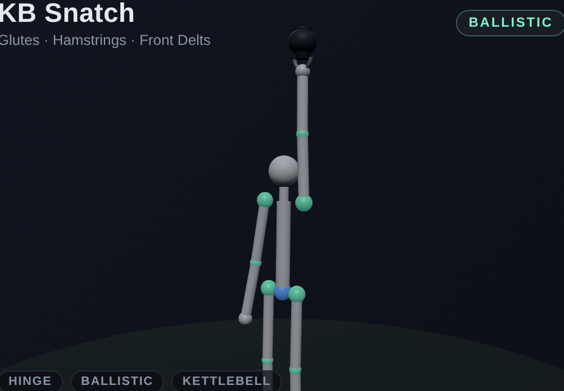 |

| KB Thruster | Goblet Reverse Lunge | One-Arm Swing |
|---|---|---|
| 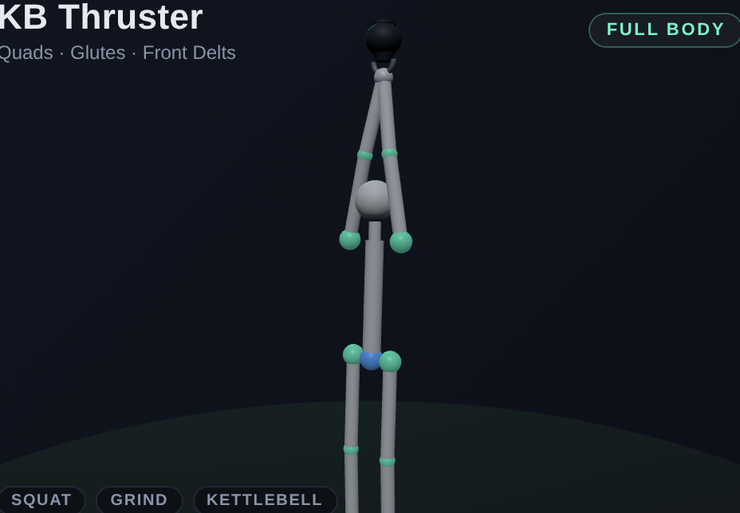 | 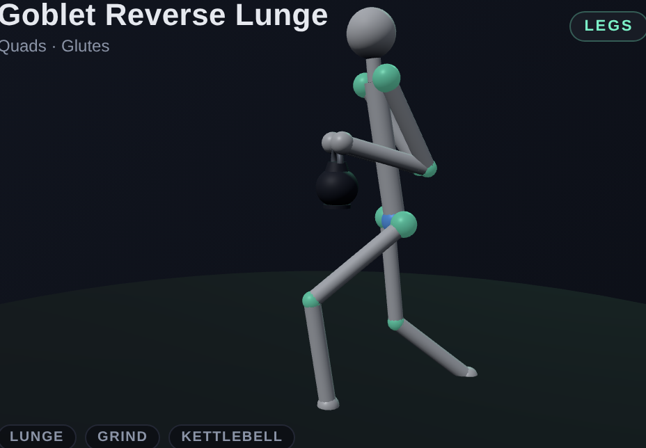 | 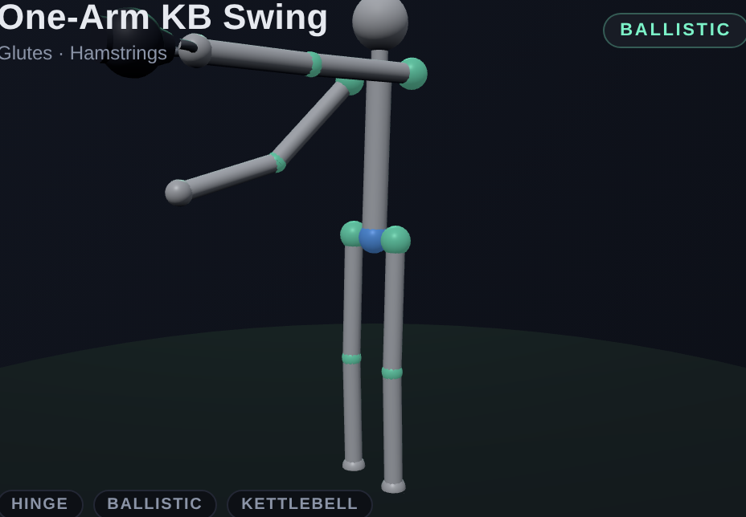 |

| Single-Arm Row | Renegade Row | KB Floor Press |
|---|---|---|
| 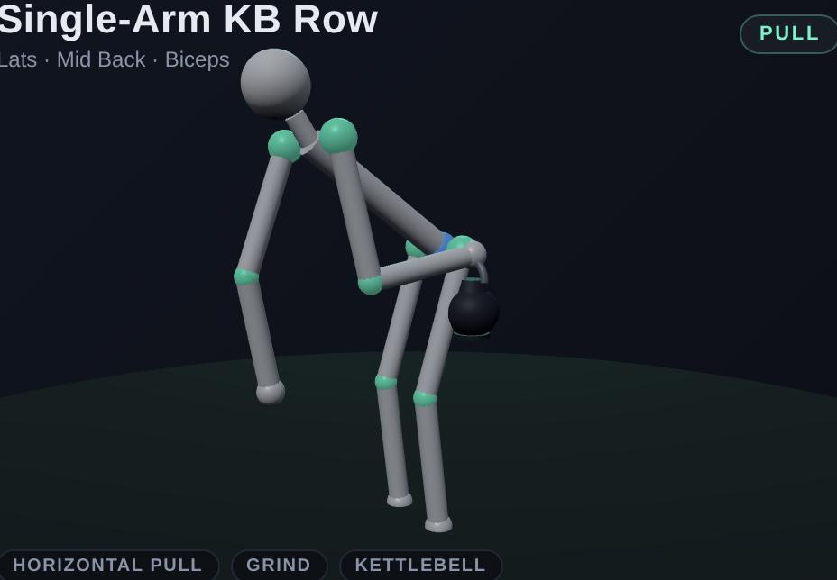 | 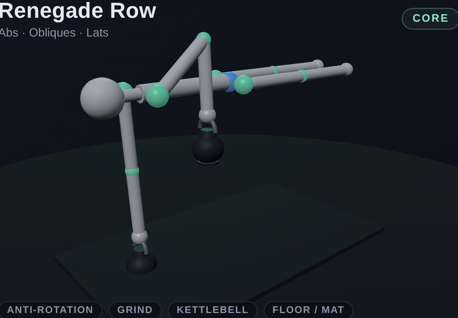 | 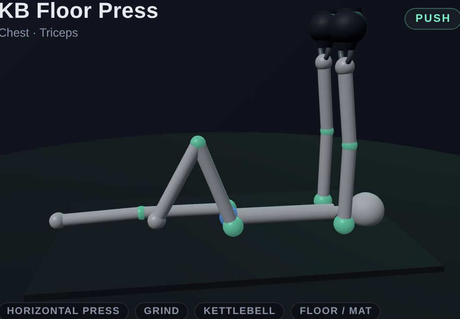 |

| Half Get-Up | KB Windmill | KB Halo |
|---|---|---|
| 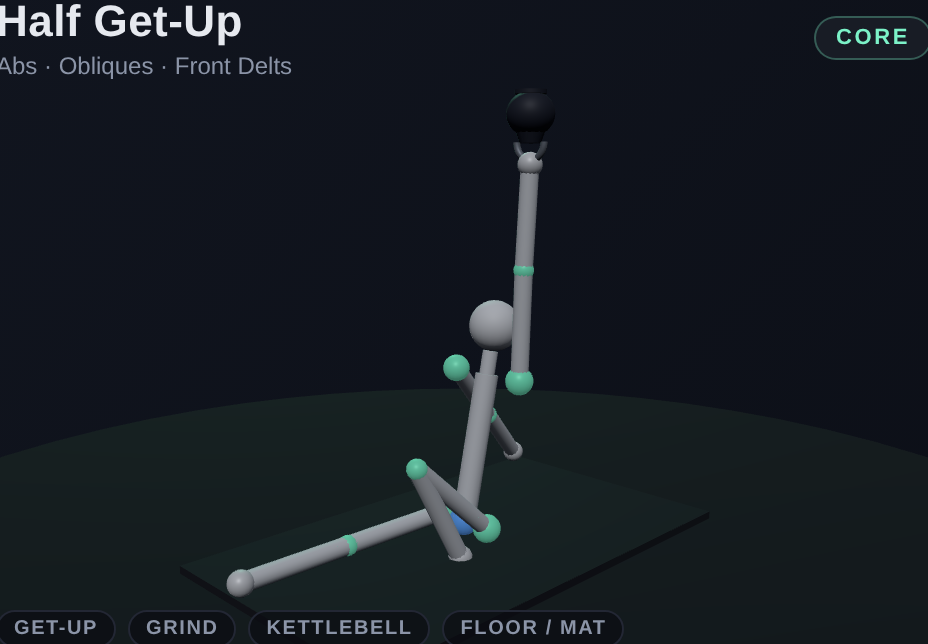 | 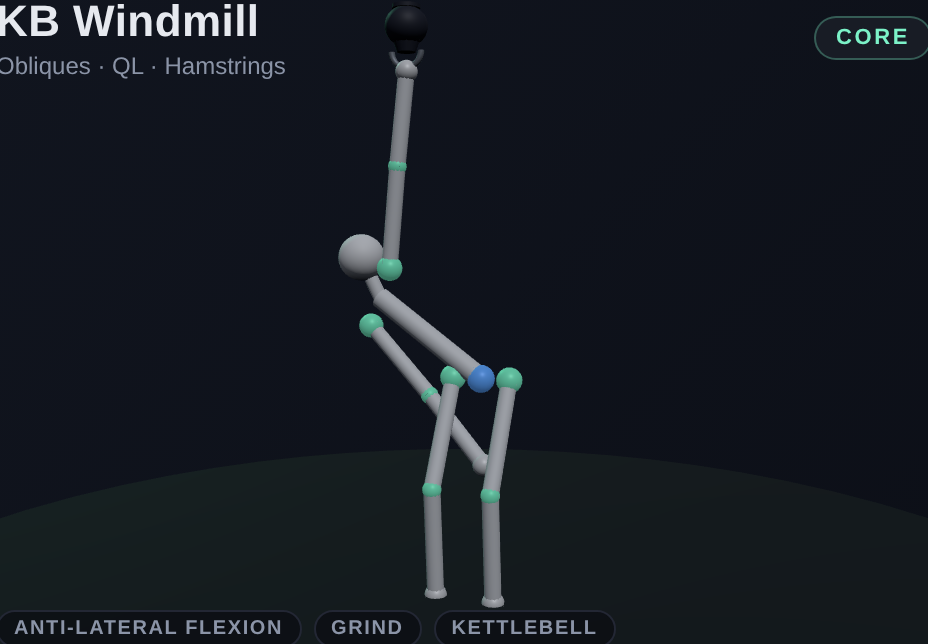 | 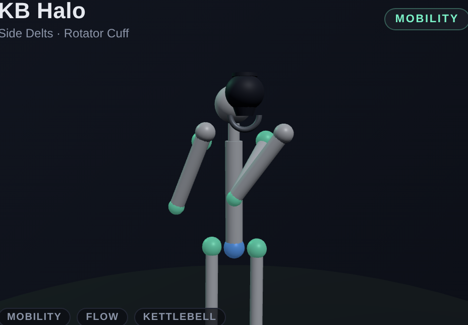 |

| Suitcase Carry | Farmer Carry | |
|---|---|---|
| 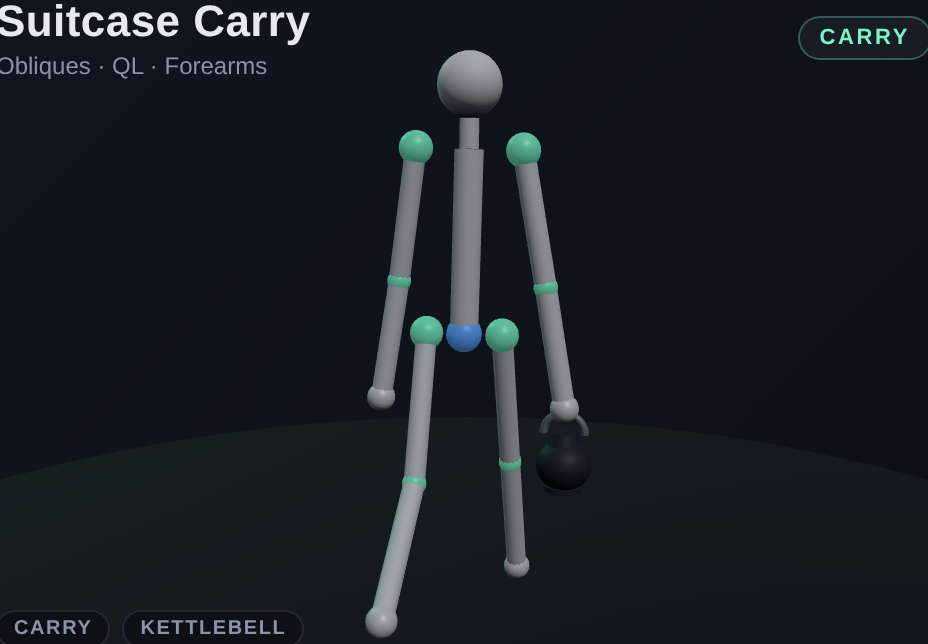 | 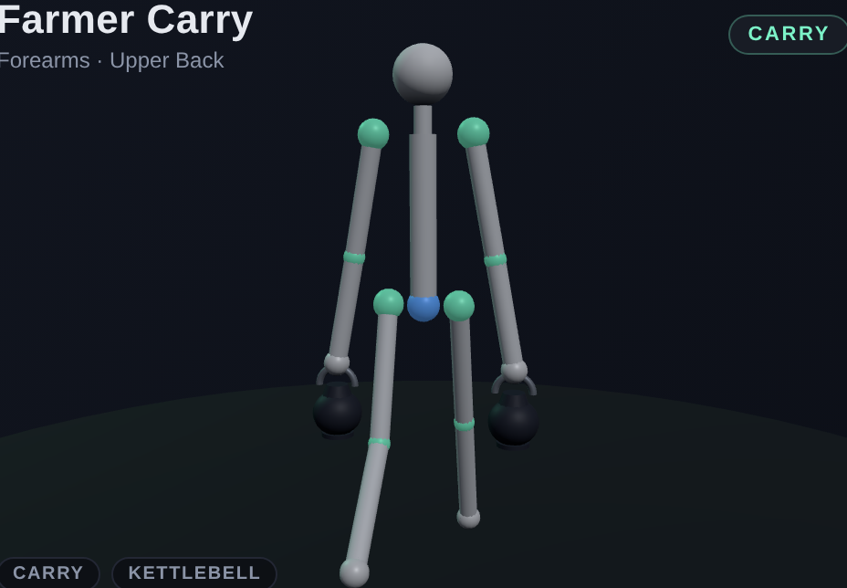 | |

### Push

| Bench Press | Incline DB Press | Overhead Press |
|---|---|---|
|  |  |  |

| Push-up | Triceps Dip | Tricep Pushdown |
|---|---|---|
|  |  |  |

### Pull

| Pull-up | Bent-over Row | Lat Pulldown |
|---|---|---|
|  |  |  |

| Bicep Curl | | |
|---|---|---|
|  | | |

### Core

| Plank | Crunch | Russian Twist |
|---|---|---|
|  |  |  |

| Hanging Leg Raise | | |
|---|---|---|
|  | | |

## Programs

Four programs ship in `src/data/routines.js`, and the Today tab switches
between them:

| Program | Days | Kit | For |
|---|---|---|---|
| **Bench 135** | 5 | Full gym | The original bench-biased upper-body split |
| **Kettlebell Foundations** | 3 | One bell + mat | Hinge, squat, press, pull, carry, get-up |
| **Kettlebell Conditioning** | 3 | One bell + mat | Ballistic power and work capacity |
| **Bench + Bells** | 4 | Gym + bell | Keeps the bench progression, adds legs and conditioning |

## Goal: bench 135

The Goal tab estimates your bench 1RM (Epley formula:
`weight × (1 + reps/30)`), plots the trend over time, and shows
percentage progress to 135 lb. The training split is biased toward the
lift:

- **Day 1** — Heavy bench (4×5), incline DB, tricep pushdown, plank
- **Day 2** — Pull-up, row, lat pulldown, bicep curl
- **Day 3** — Overhead press, dips, hanging leg raise, russian twist
- **Day 4** — Bench volume (3×8–10), push-up, incline, crunch
- **Day 5** — Light pull + core finisher

## Tech

- **Vite + vanilla JS** (no framework — direct DOM, hash router)
- **three.js** for the 3D figures and equipment
- **vite-plugin-pwa** for the service worker and installability
- **localStorage** for all session data

Single-page app, ~130 KB gzipped including three.js.

## Running it

```bash
npm install
npm run dev          # local dev server
npm run build        # production bundle in dist/
npm run preview      # preview the built bundle
npm run validate     # check every exercise against the taxonomy
npm run screenshots  # regenerate the PNGs in docs/screenshots/
```

The screenshot script (`scripts/screenshots.mjs`) builds the app,
launches `vite preview`, then drives it with Playwright (uses the
globally-installed copy if available) to capture each exercise's hero
canvas as a 1280×800 PNG at 2× device pixel ratio. Each exercise names
the frame worth photographing via `poster`, and the app freezes the
animation there with `?phase=`, so captures are deterministic. Pass id
fragments to narrow the run: `node scripts/screenshots.mjs kb-`.

## Deploying to Vercel

Already configured. Import the repo on Vercel, accept the auto-detected
Vite framework, and deploy. The bundled `vercel.json` sets the right
cache headers for the service worker (`max-age=0, must-revalidate`),
hashed assets (`immutable`, 1 year), and adds an SPA rewrite for
deep links.

The PWA install prompt only fires on HTTPS — the `*.vercel.app` URL
gets that for free.

## Project layout

```
src/
├── main.js              # router, view rendering, today/exercises/history/goal
├── pwa.js               # service worker registration + install prompt
├── store.js             # localStorage workout history + settings
├── style.css
├── data/
│   ├── taxonomy.js      # controlled vocabularies + schema validation
│   ├── rig-kit.js       # pose maths shared by every animation
│   ├── routines.js      # programs, routine builder, import/export
│   └── exercises/
│       ├── index.js     # library assembly + queries (muscle/equipment/pattern/…)
│       ├── gym.js       # barbell / dumbbell / bodyweight / machine
│       └── kettlebell.js# the kettlebell library
└── three/
    ├── stickFigure.js   # skeleton, pose application, environment (bench/bars/etc.)
    ├── props.js         # barbell/dumbbells/kettlebells/cables/plate, hand-tracked
    └── stage.js         # per-canvas three.js scene + render loop

scripts/
├── validate-exercises.mjs  # taxonomy + cross-reference checks (npm run validate)
└── screenshots.mjs         # Playwright capture for the README

public/
├── icon.svg
├── icon-maskable.svg
└── favicon.svg
```

The exercise rigs are intentionally just data — each is a few dozen
lines of `pose()` returns interpolated by `wave(t)` or laid out as
keyframes. To add a new exercise: append a `defineExercise({...})` entry
to `src/data/exercises/gym.js` or `kettlebell.js` and run
`npm run validate`. The rest of the app — grouping, filters, detail
card, routine analysis — picks it up automatically. See
[docs/EXERCISE-SCHEMA.md](docs/EXERCISE-SCHEMA.md) for the field
reference and the import path for third-party exercise data.
