# GTG — Go To Gym

A sleek, installable workout tracker built around getting stronger on
the upper body and core. Every exercise is rendered in 3D with a
procedurally-rigged stick figure on real equipment — bench, dumbbells,
barbell, cable column, dip station — so you can see the motion before
you do it.

The whole app is a static PWA: log in once, install to your phone, and
all your sets, reps, and weights are kept in `localStorage`. Works
offline at the gym.

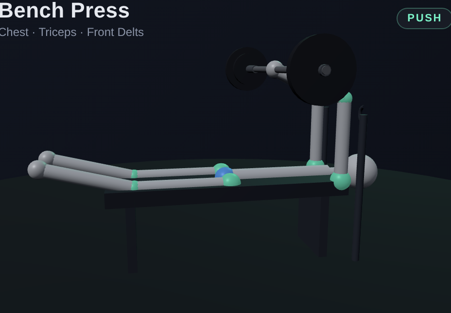

---

## What's in it

- **Today** — a daily plan based on a 5-day push/pull/shoulders/bench
  split. Hero stage shows the current exercise's animated 3D rig;
  below, a logger with sets, reps, and weight that auto-saves.
- **Exercises** — full library grouped by muscle (Chest, Back,
  Shoulders, Triceps, Biceps, Core & Abs), each tile a live mini
  three.js animation.
- **History** — every past session as a date-stamped card with total
  sets, total volume, and per-exercise breakdowns.
- **Goal** — bench-press progression toward 135 lb. Pulls your top
  set per session, runs Epley's 1RM formula, and plots the trend
  against the goal line.

## The 3D rigs

Each exercise defines an animation function `rig(t)` that returns a
pose (joint angles in radians) plus equipment hints. A small
props system reads the world position of each hand every frame and
snaps the barbell, dumbbells, cable lines, or weight plate to wherever
the hands actually are, so the equipment never drifts off the figure.

### Push

| Bench Press | Incline DB Press | Overhead Press |
|---|---|---|
|  | 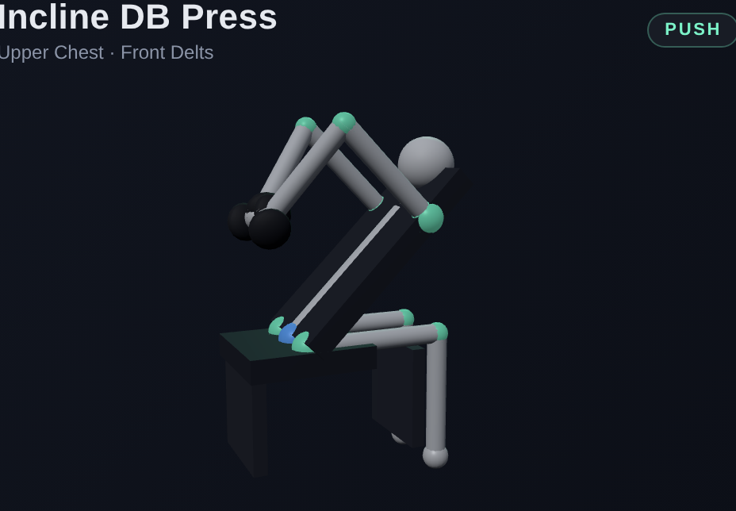 | 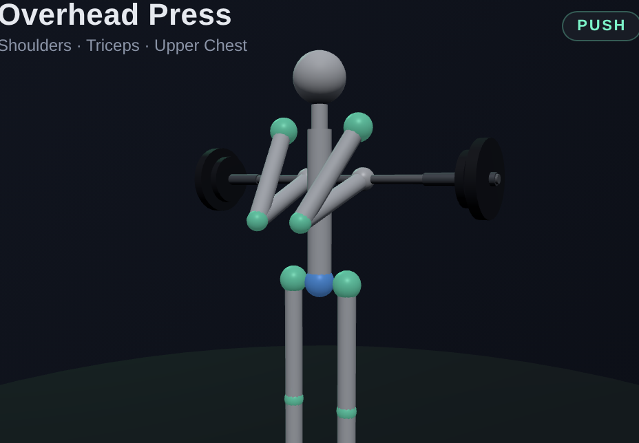 |

| Push-up | Triceps Dip | Tricep Pushdown |
|---|---|---|
| 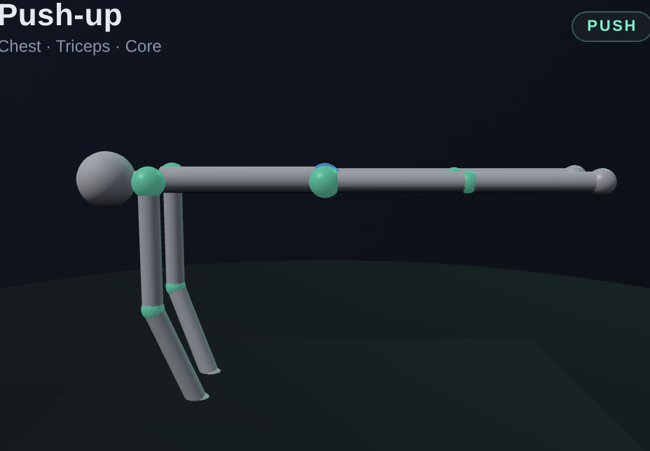 | 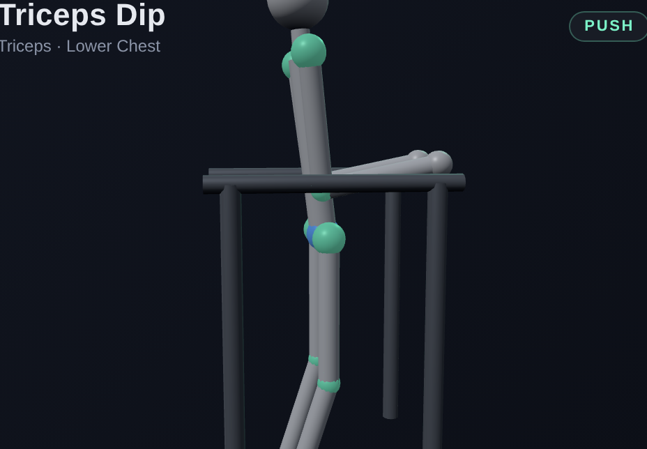 | 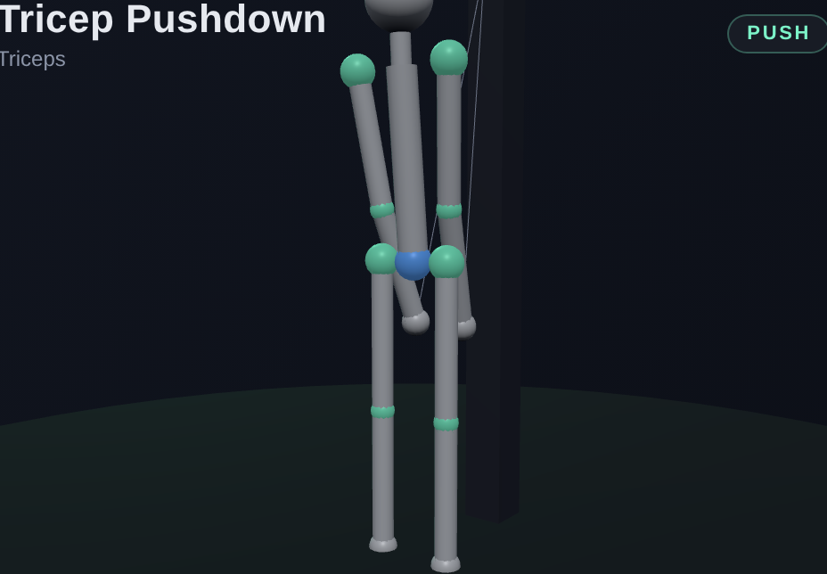 |

### Pull

| Pull-up | Bent-over Row | Lat Pulldown |
|---|---|---|
| 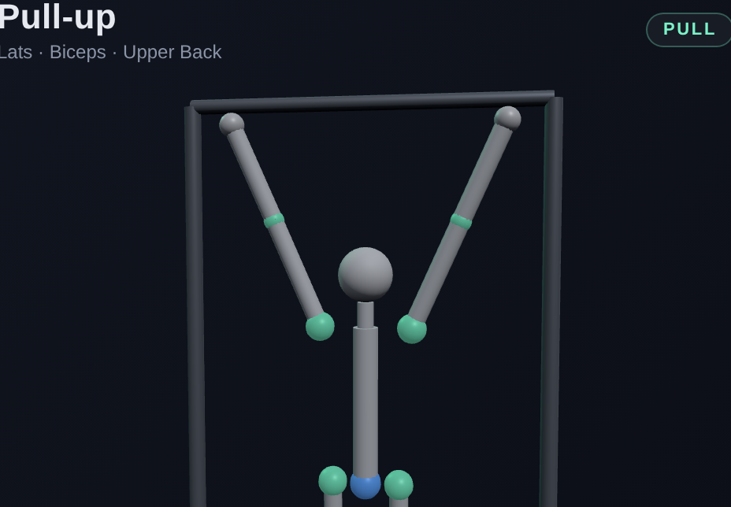 | 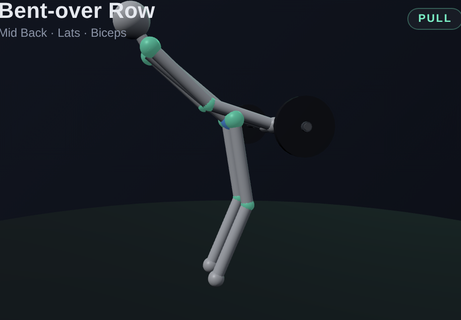 | 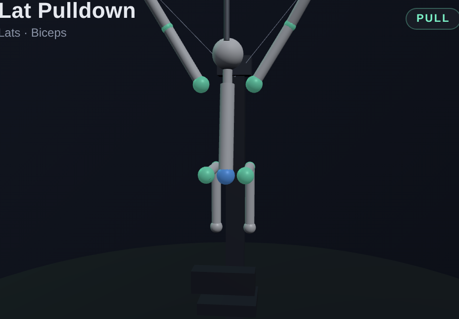 |

| Bicep Curl | | |
|---|---|---|
| 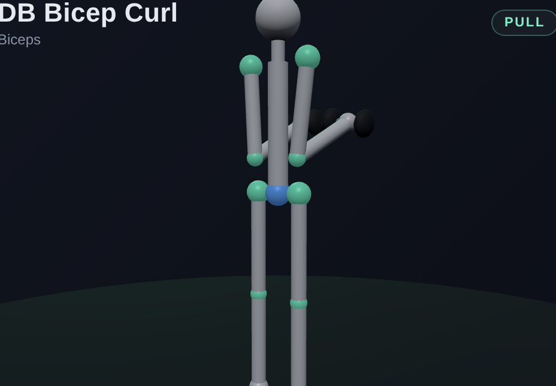 | | |

### Core

| Plank | Crunch | Russian Twist |
|---|---|---|
| 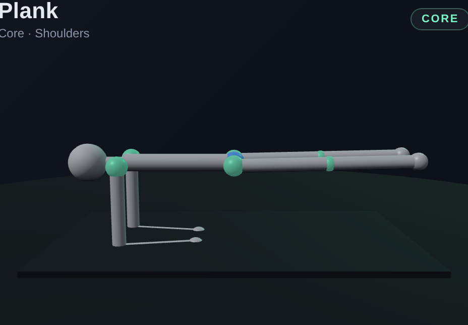 | 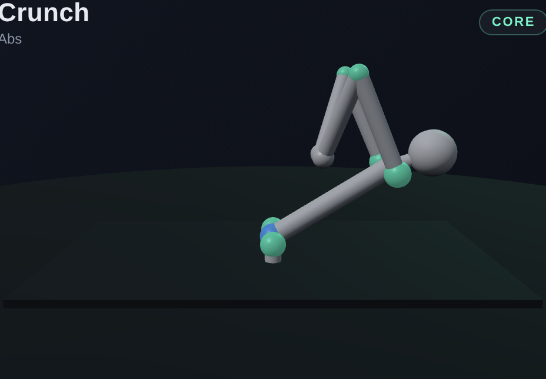 | 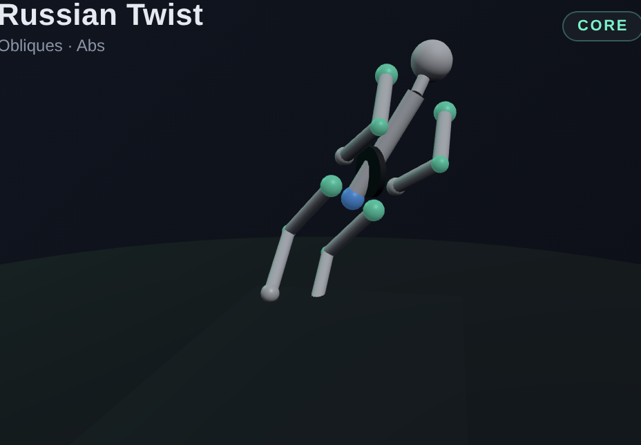 |

| Hanging Leg Raise | | |
|---|---|---|
| 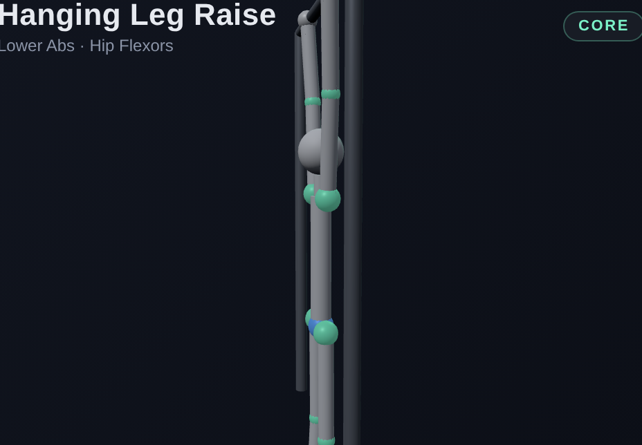 | | |

## Goal: bench 135

The Goal tab estimates your bench 1RM (Epley formula:
`weight × (1 + reps/30)`), plots the trend over time, and shows
percentage progress to 135 lb. The training split is biased toward the
lift:

- **Day 1** — Heavy bench (4×5), incline DB, tricep pushdown, plank
- **Day 2** — Pull-up, row, lat pulldown, bicep curl
- **Day 3** — Overhead press, dips, hanging leg raise, russian twist
- **Day 4** — Bench volume (3×8–10), push-up, incline, crunch
- **Day 5** — Light pull + core finisher

## Tech

- **Vite + vanilla JS** (no framework — direct DOM, hash router)
- **three.js** for the 3D figures and equipment
- **vite-plugin-pwa** for the service worker and installability
- **localStorage** for all session data

Single-page app, ~130 KB gzipped including three.js.

## Running it

```bash
npm install
npm run dev          # local dev server
npm run build        # production bundle in dist/
npm run preview      # preview the built bundle
npm run screenshots  # regenerate the PNGs in docs/screenshots/
```

The screenshot script (`scripts/screenshots.mjs`) builds the app,
launches `vite preview`, then drives it with Playwright (uses the
globally-installed copy if available) to capture each exercise's hero
canvas as a 1280×800 PNG at 2× device pixel ratio.

## Deploying to Vercel

Already configured. Import the repo on Vercel, accept the auto-detected
Vite framework, and deploy. The bundled `vercel.json` sets the right
cache headers for the service worker (`max-age=0, must-revalidate`),
hashed assets (`immutable`, 1 year), and adds an SPA rewrite for
deep links.

The PWA install prompt only fires on HTTPS — the `*.vercel.app` URL
gets that for free.

## Project layout

```
src/
├── main.js              # router, view rendering, today/exercises/history/goal
├── pwa.js               # service worker registration + install prompt
├── store.js             # localStorage workout history
├── style.css
├── data/
│   └── exercises.js     # exercise definitions: cues, defaults, rig(t), camera, equipment
└── three/
    ├── stickFigure.js   # skeleton, pose application, environment (bench/bars/etc.)
    ├── props.js         # barbell/dumbbells/cables/plate that follow hand positions
    └── stage.js         # per-canvas three.js scene + render loop

scripts/
└── screenshots.mjs      # Playwright capture for the README

public/
├── icon.svg
├── icon-maskable.svg
└── favicon.svg
```

The exercise rigs are intentionally just data — each is a few dozen
lines of `pose()` returns interpolated by `wave(t)`. To add a new
exercise: append an entry to `EXERCISES` in `src/data/exercises.js`
with primary muscles, cues, default sets, a rig function, and a
camera. The rest of the app picks it up automatically.
